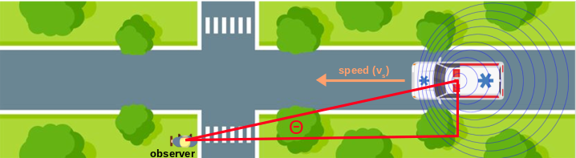
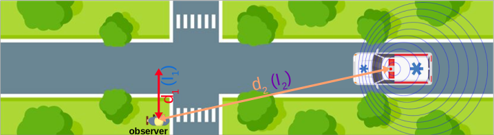

# Simulate Doppler effect using Matlab

Simulate passing ambulance car's sound using Doppler effect and Inverse Square Law for sound intensity.

# Equations

## Doppler effect

## Sound intensity

